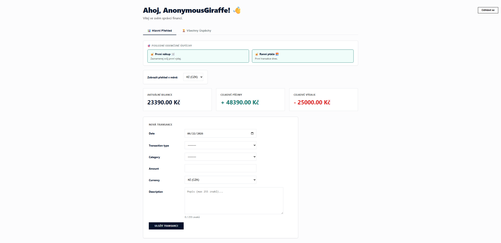
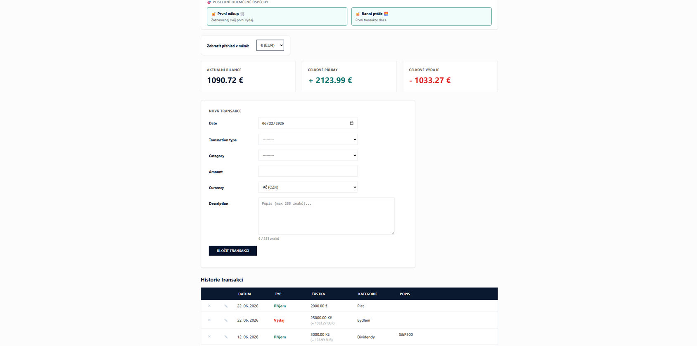
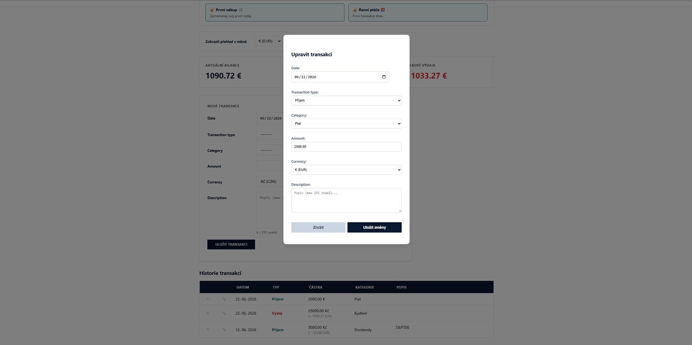
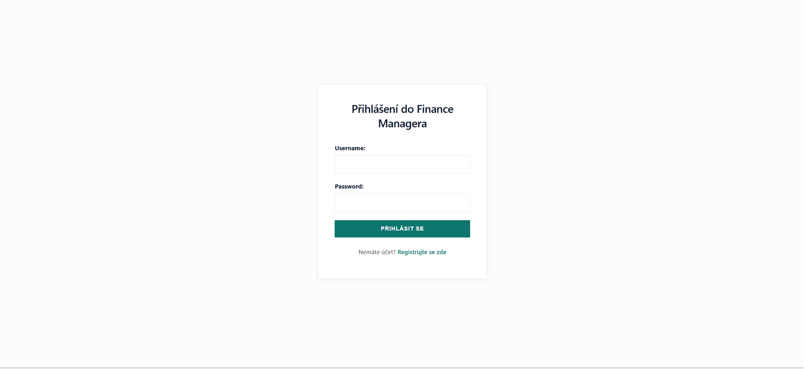
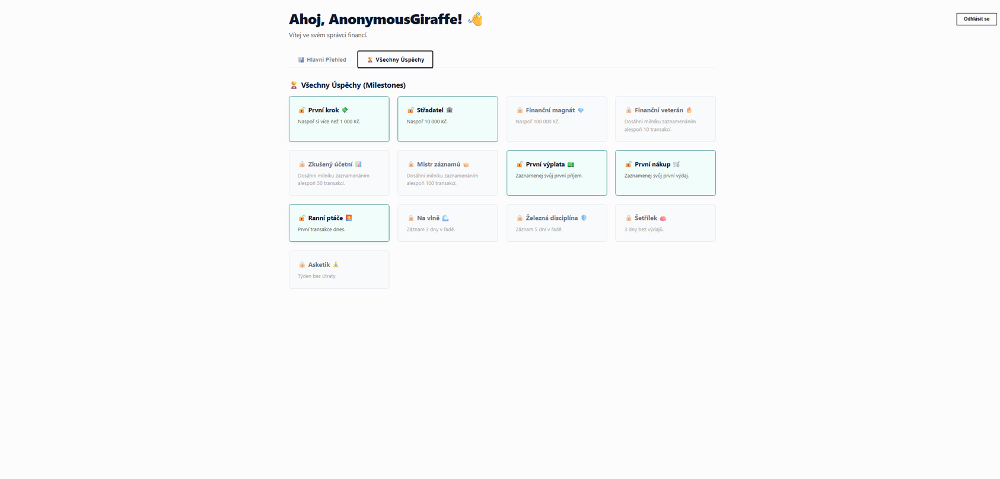

# 💰 Financial Manager

A clean, gamified personal finance tracker built with Django. This application allows users to manage income/expense transactions, track balances across multiple currencies using live exchange rates, and unlock achievements through smart milestones.

## 🚀 Features

* **Real-time Metrics:** Automatic balance, income, and expense calculation.
* **Currency Support:** Dynamic conversion between **CZK, USD, and EUR** using live ČNB exchange rates.
* **Gamification Engine:** Unlockable milestones for consistency, streaks, and savings targets.
* **AJAX-Driven UI:** Instant dashboard updates without page reloads.
* **Clean Architecture:** Refactored codebase with modular CSS and separated business logic.

## 🎨 Showcase

### Core Dashboard

*The heart of the application: track your balance, income, and expenses in real-time.*

### Features & Interactions
| History & Currencies | Delete & Edit Actions | Login & Security |
| :---: | :---: | :---: |
|  |  |  |

### Gamification

*Stay motivated by unlocking milestones for your saving habits and streaks.*

## 🛠 Tech Stack

* **Backend:** Django 6.0, Python 3.14
* **Frontend:** Vanilla JS (AJAX), HTML5, CSS3
* **APIs:** ČNB API (Live exchange rates)
* **Database:** SQLite
